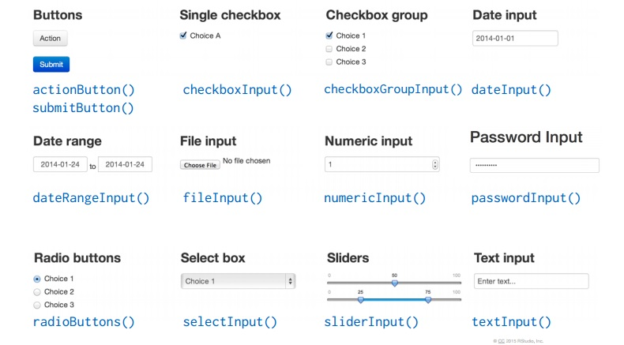
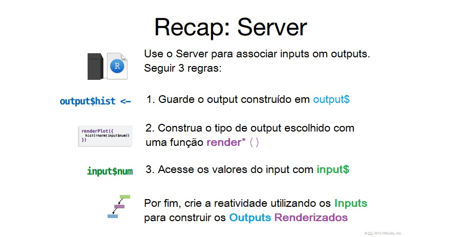

```{r setup, include=FALSE}
options(htmltools.dir.version = FALSE)
knitr::opts_chunk$set(echo = FALSE)
```

# Sumário

- O que é o shiny?

- Como ele funciona?

- Interface de usuário

- Input e Outputs

- Server

- Compartilhando

---

## O que é o Shiny?

- Um pacote de R (`shiny`).

- Sistema para desenvolvimento de aplicações web usando o R.

- Um servidor web (`shiny server`).

<br>


---

# Ciclo da ciência de dados

<br>
<br>
<br>

```{r, fig.align='center'}
knitr::include_graphics("https://raw.githubusercontent.com/hadley/r4ds/master/diagrams/data-science.png")
```

---

## Tutorial completo do RStudio sobre Shiny

- Tutorial: https://shiny.rstudio.com/tutorial/

- Exemplos: https://shiny.rstudio.com/gallery/

<br>
<br>


---

## Como funciona?


---

## Template


* **ui** - constrói a interface do usuário, isto é, a **arquitetura** da página.  

* **server** - constrói os objetos apresentados ao usuário.

---

## Exemplo 1

Vamos para o R!

<br>
<br>


---
 
## Inputs e Outputs

<br>

**Inputs** são widgets que possibilitam a interação do usuário com o App.  

**Outputs** são a resposta do app às ações exercidas pelo usuário.

<br>
<br>

Um app pode ter vários inputs e outputs.

---

## Funções inputs


---

## Sintaxe


---

## Funções Outputs


---

## Sintaxe


---

## Recapitulando


---

## Exemplo 2

Ao R!

<br>
<br>


---

## Server.R

<br>
<br>

Para a construção da função `server()`, precisamos seguir 3 regras.

---

## Regras da função server()


---

## Regras da função server()


---

## Funções render*()


---

## Sintaxe


---

## Recapitulando



---

## Compartilhando seu app

Todo aplicativo Shiny é alimentado por um computador rodando R.


---

## Compartilhando seu app
  
* [Shiny server](https://www.rstudio.com/products/shiny/shiny-server/): programa backend gratuito que monta um servidor web em linux feito para hospedar aplicativos em Shiny.

* [Shiny Server Pro](https://www.rstudio.com/products/shiny-server-pro/): disponibiliza ferramentas de segurança, performance, gerencialmente e suporte.

* [shinyapps.io](http://www.shinyapps.io/): sistema do RStudio para a hospedagem de aplicativos em Shiny.

* [Now](http://curso-r.com/blog/2018/03/05/2018-03-05-shiny-now/): sistema que permite a hospedagem de aplicativos feitos com [Docker](https://www.docker.com/).

---

## Exemplo 3 e 4: DT e plotly

R!

<br>
<br>


